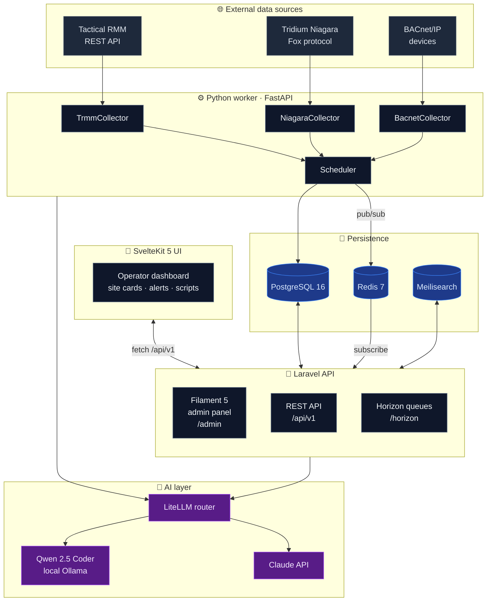

<div align="center">

# BmsSiteOps

**Unified operations platform for HVAC/MEP contractors**

_Tactical RMM · Tridium Niagara · BACnet/IP — under one site, with AI on top._

[](https://github.com/D-S-Tech/BmsSiteOps/actions/workflows/ci.yml)
[](LICENSE)
[](#-sprint-roadmap)
[](#-testing--ci)

[](https://laravel.com)
[](https://filamentphp.com)
[](https://kit.svelte.dev)
[](https://python.org)
[](https://postgresql.org)
[](https://docs.docker.com/compose)

[Overview](#-overview) ·
[Architecture](#-architecture) ·
[Quick start](#-quick-start) ·
[Stack](#-tech-stack) ·
[Roadmap](#-sprint-roadmap) ·
[ADRs](docs/adr/) ·
[Contributing](CONTRIBUTING.md)

</div>

---

## 🎯 Overview

Most RMM platforms treat servers and workstations as the world. Most building automation systems treat HVAC and controls as the world. For an MEP/BMS contractor servicing commercial buildings, **neither half is enough** — when a tenant complains the office is hot, the answer might live in a tripped RTU fan, a stuck VAV damper, a SQL backup that hung the Niagara supervisor, or a Windows update that broke the station service.

BmsSiteOps unifies both halves under one **site**, normalizes the events, and lets an AI layer reason across them.

### What it does

- 📡 **Collects** operational telemetry from Tactical RMM (IT) and Tridium Niagara / BACnet (BMS) in real time
- 🏢 **Organizes** everything by physical **site** — the operator's mental model, not the vendor's
- 🤖 **Triages** alerts with AI (Claude + local Qwen 2.5 Coder), proposing the first response
- 📝 **Authors** remediation scripts from natural-language descriptions
- 📊 **Briefs** operators on what changed at each site overnight
- 🔌 Exposes an **MCP endpoint** so the same data is accessible to other AI tools

### What it is not

- Not a replacement for Tactical RMM or Niagara — it sits on top of them
- Not a metrics/observability tool like Grafana or Datadog
- Not a public SaaS yet — single-tenant deployment at BMCE, multi-tenant ready under the hood

---

## 🏛️ Architecture



**Reverse proxy:** Caddy 2 terminates TLS at `ops.bmssiteops.com` (web + API) and `ops-mcp.bmssiteops.com` (MCP endpoint), with automatic Let's Encrypt and HTTP/3.

**Multi-tenancy:** row-level via `tenant_id` foreign key + global Eloquent scope. Every tenant-scoped model uses the `BelongsToTenant` trait. See [ADR 0002](docs/adr/0002-multi-tenancy-row-level.md).

Full architecture document: [`docs/ARCHITECTURE.md`](docs/ARCHITECTURE.md).

---

## ⚡ Quick start

> **Requirements:** Docker 24+, Docker Compose v2, ~6 GB RAM for the full dev stack.

```bash
# 1. Clone and enter
git clone https://github.com/D-S-Tech/BmsSiteOps.git
cd BmsSiteOps

# 2. Provision environment
cp .env.example .env
# ✏️  Edit .env — set APP_KEY (php artisan key:generate output) and
#    replace every `changeme` value with a strong secret.

# 3. Bring up infrastructure only (postgres, redis, meilisearch)
make dev-up

# 4. Bring up the full stack (api, web, worker, caddy)
make dev-up-all

# 5. Run database migrations
make api-migrate

# 6. Tail logs
make logs           # all services
make logs-api       # Laravel only
make logs-worker    # Python only
make logs-web       # SvelteKit only
```

Once everything is healthy:

| Surface | Local URL | Description |
|---|---|---|
| Web app | http://localhost:8080 | SvelteKit operator UI (via Caddy) |
| Filament admin | http://localhost:8080/admin | Laravel admin panel |
| Horizon | http://localhost:8080/horizon | Queue dashboard |
| MCP endpoint | http://ops-mcp.local:8080 | Model Context Protocol server |
| Meilisearch | http://localhost:7700 | Search dashboard |

Add the dev hostnames to `/etc/hosts`:

```
127.0.0.1   ops.local ops-mcp.local
```

Full `make` target list: `make help`.

---

## 🧰 Tech stack

<table>
<tr>
<td width="50%" valign="top">

**Backend**

- 🐘 **Laravel 13** (PHP 8.3) — REST API + Filament 5 admin
- 🔐 **Laravel Sanctum 4** — token-based API auth
- ⚙️ **Laravel Horizon 5** — queue dashboard on Redis
- 🧪 **PHPUnit 12** + **Laravel Pao** — testing
- ✨ **Laravel Pint** — formatter

</td>
<td width="50%" valign="top">

**Frontend**

- 🎨 **SvelteKit 2.57** + **Svelte 5** (runes mode)
- 📘 **TypeScript 6** strict
- 🎨 **Tailwind 4** (via `@tailwindcss/vite`)
- 🧪 **Vitest 4** — unit tests
- ✨ **Prettier + ESLint** + `svelte-check`

</td>
</tr>
<tr>
<td valign="top">

**Worker**

- 🐍 **Python 3.12** + **FastAPI**
- 📦 **uv** — Astral's package manager
- ⚡ **asyncpg** · **redis-py** · **httpx**
- 🤖 **Anthropic SDK** · **bacpypes3**
- 🧪 **pytest** · **ruff** · **mypy** (strict)

</td>
<td valign="top">

**Infra**

- 🐳 **Docker** + **Docker Compose** (profiles)
- 🌐 **Caddy 2** — auto-HTTPS, HTTP/3, FastCGI
- 🐘 **PostgreSQL 16** (TimescaleDB later)
- 🔴 **Redis 7** — cache, queues, pub/sub
- 🔍 **Meilisearch** — full-text search
- 🧠 **LiteLLM** — multi-provider AI router

</td>
</tr>
</table>

Decisions and trade-offs documented in [`docs/adr/0003-stack-choices.md`](docs/adr/0003-stack-choices.md) and [`docs/adr/0006-containerization-patterns.md`](docs/adr/0006-containerization-patterns.md).

---

## 📁 Project structure

```
BmsSiteOps/
├── apps/
│   ├── api/                     Laravel 13 + Filament 5 + Sanctum + Horizon
│   │   ├── app/Models/          Tenant, Site, User, Source, Device, Event
│   │   ├── app/Support/         CurrentTenant context, TenantScope
│   │   └── tests/Feature/       Registry · API · dashboard · brief · triage tests (110/110 ✅)
│   │
│   ├── web/                     SvelteKit 5 + TypeScript + Tailwind 4
│   │   ├── src/lib/             API + registry clients · format helpers · auth
│   │   └── src/routes/          sites · devices · dashboard (brief + triage card)
│   │
│   └── worker/                  Python 3.12 + FastAPI + uv
│       ├── app/main.py          FastAPI app + /health
│       ├── app/collectors/      TRMM · Niagara (oBIX+Fox) · BACnet — all live
│       ├── app/ai/              LLM seam · LiteLLM client · Site Brief generator
│       ├── app/remediation/     Remediation seam · TRMM transport · dispatcher
│       ├── app/clients/         TRMM/oBIX clients · HMAC ingest + brief clients
│       ├── app/runner.py        SyncRunner — collector → API
│       └── tests/               pytest suite (92/92 ✅)
│
├── infra/
│   ├── docker/                  Per-app Dockerfiles (multi-stage)
│   ├── compose/                 docker-compose.{dev,prod}.yml
│   └── caddy/                   Caddyfile + Caddyfile.dev
│
├── docs/
│   ├── ARCHITECTURE.md          System-level architecture
│   └── adr/                     8 architecture decision records
│
└── .github/workflows/ci.yml     4 parallel jobs: hygiene · api · web · worker
```

---

## 🗺️ Sprint roadmap

> **Status (May 2026): Sprint 5 complete — alert triage: per-tenant rules with a pure matcher; ingestion runs triage in-line and mutes/flags/ignores per rule; Filament CRUD + dashboard indicator. Worker remediation seam ready for the next sprint to wire. 224 tests green.**

<table>
<thead>
<tr><th width="80">Sprint</th><th width="120">Status</th><th>Deliverable</th></tr>
</thead>
<tbody>
<tr><td><b>0</b></td><td>🟢 95% done</td><td>Repo scaffolding · multi-tenancy infrastructure · Docker Compose · CI · SvelteKit + Python worker scaffolds · deployment-as-code (scripts + runbook). Only live provisioning remains.</td></tr>
<tr><td><b>1</b></td><td>🟢 Done</td><td>TRMM Collector · unified devices registry · internal HMAC ingestion · public REST API · Filament admin · SvelteKit pages — first end-to-end ingestion</td></tr>
<tr><td><b>2</b></td><td>🟢 Done</td><td>Niagara collector — oBIX (live) + Fox (experimental) · BACnet/IP via bacpypes3 · source transport field — three BMS transports through one ingestion path</td></tr>
<tr><td><b>3</b></td><td>🟢 Done</td><td>TimescaleDB hypertable for events · site summary + timeline API · SvelteKit site dashboard · device-muting operator workflow</td></tr>
<tr><td><b>4</b></td><td>🟢 Done</td><td>AI Site Brief end to end — LiteLLM LLM seam · context → generate → store over HMAC · dashboard renders the latest brief</td></tr>
<tr><td><b>5</b></td><td>🟢 Done</td><td>Alert Triage end to end — rule matcher · in-line action execution from ingestion (mute / mark / ignore) · Filament CRUD · worker remediation seam (TRMM agent restart, foundation only)</td></tr>
<tr><td><b>6</b></td><td>⏳ Next</td><td>Script Authoring AI (Qwen 2.5 Coder via Ollama)</td></tr>
<tr><td><b>7</b></td><td>⏳ Planned</td><td>Site Q&A · RAG over telemetry + documents · MCP endpoint at <code>ops-mcp.bmssiteops.com/sse</code></td></tr>
</tbody>
</table>

### Sprint 0 detail

- [x] Day 1 — Repo bootstrap, 6 ADRs, security baseline ([`e001938`](https://github.com/D-S-Tech/BmsSiteOps/commit/e001938))
- [x] Day 2 — Docker Compose stack (postgres, redis, meilisearch, caddy, api, web, worker) ([`8f3e95f`](https://github.com/D-S-Tech/BmsSiteOps/commit/8f3e95f))
- [x] Day 3 — Laravel 13 + Filament 5 + multi-tenancy + 6 tenant-isolation tests ([`0889f43`](https://github.com/D-S-Tech/BmsSiteOps/commit/0889f43))
- [x] Day 4 — SvelteKit 5 frontend + Python worker scaffolds + collectors ABC ([`6cb81e5`](https://github.com/D-S-Tech/BmsSiteOps/commit/6cb81e5))
- [x] Day 5a — Deployment-as-code: `bootstrap-server.sh`, `deploy.sh`, `DEPLOYMENT.md`, ADR 0007, prod env template ([deploy docs](docs/DEPLOYMENT.md))
- [ ] Day 5b — Live provisioning: LXC + DNS + first `make prod-up` _(operator step)_

### Sprint 1 detail

- [x] 1.1 — Source/Device/Event registry data model + enums + factories (11 tests) ([`fab400b`](https://github.com/D-S-Tech/BmsSiteOps/commit/fab400b))
- [x] 1.2 — Internal HMAC ingestion API + atomic sync service (10 tests) ([`7b3bab2`](https://github.com/D-S-Tech/BmsSiteOps/commit/7b3bab2))
- [x] 1.3 — Public REST API: sites · sources (CRUD) · devices · events (12 tests) ([`0c97fe5`](https://github.com/D-S-Tech/BmsSiteOps/commit/0c97fe5))
- [x] 1.4 — Filament 5 admin resources for the registry ([`9365f31`](https://github.com/D-S-Tech/BmsSiteOps/commit/9365f31))
- [x] 1.5 — TRMM collector + REST client + HMAC ingest client + SyncRunner (29 worker tests) ([`061e37c`](https://github.com/D-S-Tech/BmsSiteOps/commit/061e37c))
- [x] 1.6 — SvelteKit registry types · helpers · sites + devices pages (20 web tests) ([`14bab0a`](https://github.com/D-S-Tech/BmsSiteOps/commit/14bab0a))

### Sprint 2 detail

- [x] 2.1a — Source `transport` field (obix·rest·fox) + reactive Filament select (7 tests) ([`ec4ac2f`](https://github.com/D-S-Tech/BmsSiteOps/commit/ec4ac2f))
- [x] 2.1b — Niagara oBIX client + collector (oBIX transport, live) ([`d70d516`](https://github.com/D-S-Tech/BmsSiteOps/commit/d70d516))
- [x] 2.2 — BACnet/IP collector via bacpypes3 (transport seam + fake-tested mapping) ([`93c8a4a`](https://github.com/D-S-Tech/BmsSiteOps/commit/93c8a4a))
- [x] 2.3 — Niagara Fox transport — value codec (tested) + mapping; live session experimental, JACE-validation flagged ([`5515174`](https://github.com/D-S-Tech/BmsSiteOps/commit/5515174))

> **Hardware-validation note:** the BACnet bacpypes3 wiring and the Fox live session (handshake/auth/BQL) are written but not exercised in CI — they require validation against real hardware. Each is clearly flagged in source; neither claims to work until verified.

### Sprint 3 detail

- [x] 3.1 — TimescaleDB hypertable for events (pgsql-guarded, no-op on SQLite) + ADR 0008 + retention/compression config (48 tests) ([`5812988`](https://github.com/D-S-Tech/BmsSiteOps/commit/5812988))
- [x] 3.2 — Site summary + timeline dashboard API (portable aggregations, PHP-bucketed timeline) (53 tests) ([`6fc9429`](https://github.com/D-S-Tech/BmsSiteOps/commit/6fc9429))
- [x] 3.3 — SvelteKit site dashboard `/sites/[id]` — stat cards, severity timeline, recent events (22 web tests) ([`a3d1f64`](https://github.com/D-S-Tech/BmsSiteOps/commit/a3d1f64))
- [x] 3.4 — Device-muting operator workflow — mute/unmute API, dashboard suppression, Filament controls (60 tests) ([`c21b3a2`](https://github.com/D-S-Tech/BmsSiteOps/commit/c21b3a2))

> **DB-validation note:** the TimescaleDB hypertable conversion runs only on PostgreSQL and is not exercised by CI (which uses SQLite); it is written per the TimescaleDB docs and flagged for validation on a real instance — see ADR 0008.

### Sprint 4 detail

- [x] 4.1 — AI Site Brief storage + internal HMAC channel; SiteContextService (DRY rollups shared with the dashboard); public read API (71 tests) ([`dbb9fed`](https://github.com/D-S-Tech/BmsSiteOps/commit/dbb9fed))
- [x] 4.2 — Worker LLM seam (LiteLLM client + fake) · SiteBriefGenerator (pure prompt building) · BriefRunner (80 worker tests) ([`8fff44c`](https://github.com/D-S-Tech/BmsSiteOps/commit/8fff44c))
- [x] 4.3 — Site dashboard renders the latest AI Site Brief (22 web tests) ([`534c556`](https://github.com/D-S-Tech/BmsSiteOps/commit/534c556))

> **AI-integration note:** the brief generator is unit-tested end to end via a fake LLM client and a mocked LiteLLM transport (respx). The live LiteLLM proxy call is an integration concern exercised in deployment, not in CI — consistent with the hardware/DB validation posture above.

### Sprint 5 detail

- [x] 5.1 — Triage core: `triage_rules` + `triage_decisions` tables; pure `TriageRuleMatcher` (severity / kind / metric glob / value substring, AND-of-non-null); `TriageService` evaluator with priority + tenant scope; public read API (100 api tests) ([`f924d99`](https://github.com/D-S-Tech/BmsSiteOps/commit/f924d99))
- [x] 5.2 — `TriageActionExecutor` (mute_device with optional duration, mark_for_review, ignore); wired into `SourceSyncService` so ingestion evaluates + acts in the same transaction; Filament TriageRule CRUD + read-only decision audit log (109 api tests) ([`a5a5b41`](https://github.com/D-S-Tech/BmsSiteOps/commit/a5a5b41))
- [x] 5.3 — Worker remediation seam (transport ABC, fake, `RemediationDispatcher`, `TrmmRemediationTransport` for `restart_trmm_agent`); brief context includes 24h triage breakdown; SvelteKit dashboard renders a Triage activity card (224 total tests) ([`9285700`](https://github.com/D-S-Tech/BmsSiteOps/commit/9285700))

> **TRMM-integration note:** the remediation seam is built and the TRMM transport's request shape (URL, `X-API-KEY` header, error mapping) is verified with respx. The live call against a running TRMM instance is integration-only and not in CI — same posture as the LiteLLM and TimescaleDB validation notes. No Laravel→worker dispatch path exists yet for `restart_trmm_agent`; that wiring is a future sprint.

---

## 🧪 Testing & CI

| App | Framework | Tests | Status |
|---|---|---:|:---:|
| `apps/api` (Laravel) | PHPUnit 12 + Pao | 110 | ✅ |
| `apps/web` (SvelteKit) | Vitest 4 | 22 | ✅ |
| `apps/worker` (Python) | pytest 8 | 92 | ✅ |
| **Total** | | **224** | **✅** |

The `ci.yml` workflow runs four parallel jobs on every push/PR:

| Job | Checks |
|---|---|
| **Repo hygiene** | Required docs present · no `.env` committed · gitleaks secret scan over full history |
| **API (Laravel)** | `composer install` · `pint --test` · `php artisan test` against in-memory SQLite |
| **Web (SvelteKit)** | `npm ci` · `prettier --check` · `eslint .` · `svelte-check` · `vitest --run` · production build |
| **Worker (Python)** | `uv sync --frozen` · `ruff check` · `ruff format --check` · `mypy app` (strict) · `pytest` |

---

## 🤖 AI use cases

The AI layer is split across four discrete capabilities, each landing in its own sprint:

<table>
<tr>
<td width="50%" valign="top">

### 📰 Daily Site Brief _(Sprint 4)_

Every morning, Claude reads the last 24h of events per site and writes a one-paragraph summary: what changed, what failed, what needs attention. Read with coffee, intervene before tenants notice.

</td>
<td width="50%" valign="top">

### 🚨 Alert Triage _(Sprint 5)_

When a TRMM alert or Niagara alarm hits the platform, the AI classifies severity, suggests the first response, and — for known patterns — runs a pre-approved remediation script. Operators approve or override.

</td>
</tr>
<tr>
<td valign="top">

### 📝 Script Authoring _(Sprint 6)_

> _"Write me a TRMM check that fires if Niagara station service is stopped for >5 minutes."_

Qwen 2.5 Coder 32B (local, on the BMCE AI workstation) produces TRMM-compatible PowerShell or Bash. Reviewable diff before it goes live.

</td>
<td valign="top">

### 💬 Site Q&A + MCP _(Sprint 7)_

Natural-language queries over a single site's telemetry, documents, and history. Exposed via the Model Context Protocol at `ops-mcp.bmssiteops.com/sse` so the same data is callable from Claude Desktop, Cursor, or any MCP-aware tool.

</td>
</tr>
</table>

---

## 📚 Architecture Decision Records

Every non-trivial design choice is recorded in [`docs/adr/`](docs/adr/):

| # | Decision |
|---|---|
| [0001](docs/adr/0001-monorepo.md) | Monorepo (single repository for api, web, worker, infra) |
| [0002](docs/adr/0002-multi-tenancy-row-level.md) | Multi-tenancy: row-level via `tenant_id` + global scope |
| [0003](docs/adr/0003-stack-choices.md) | Stack: Laravel 13 + SvelteKit 5 + Python 3.12 + Postgres 16 |
| [0004](docs/adr/0004-public-repo-security.md) | Public repo security posture |
| [0005](docs/adr/0005-license-agpl.md) | License: AGPL-3.0 |
| [0006](docs/adr/0006-containerization-patterns.md) | Caddy + PHP-FPM via FastCGI · adapter-node SSR · uv for Python |
| [0007](docs/adr/0007-deployment-topology.md) | Deployment topology: single LXC + Docker Compose + git-pull deploy |

---

## 🛠️ Development workflow

Common `make` targets (full list: `make help`):

```bash
# Lifecycle
make dev-up                 # infra only (postgres, redis, meilisearch)
make dev-up-all             # full stack (+ api, web, worker, caddy)
make dev-down               # stop everything
make dev-clean              # tear down + DESTROY all volumes
make dev-rebuild            # rebuild images after Dockerfile changes

# Shells
make sh-api · sh-worker · sh-web · sh-db · sh-redis

# Laravel
make api-migrate · api-seed · api-fresh · api-test · api-pint

# SvelteKit
make web-install · web-check · web-test

# Python worker
make worker-test · worker-lint

# Production
make prod-up · prod-deploy
```

---

## 🤝 Contributing

This is an internal-first tool. External contributions are acknowledged but may not be merged while the project is in early development. If you're interested in commercial use, hosted service, or contributing meaningfully, [open an issue](https://github.com/D-S-Tech/BmsSiteOps/issues/new) to start a conversation.

See [`CONTRIBUTING.md`](CONTRIBUTING.md) for code style, commit message format (Conventional Commits), and the PR checklist.

Security disclosures go to [`SECURITY.md`](SECURITY.md).

---

## 📜 License

[**AGPL-3.0**](LICENSE). If you fork BmsSiteOps and run a hosted service from it, you must publish your modifications under the same license. See [ADR 0005](docs/adr/0005-license-agpl.md) for the reasoning.

---

## 👤 Maintainer

**Denny Pjevalica** — [Bold Mechanical & Controls Enterprise, Inc.](https://boldmech.com) (BMCE) / D&S Tech LLC

Based in Paterson, NJ. Operating in the NJ/NY commercial HVAC/MEP/BMS market since well before "AIOps" was a marketing term.

---

<div align="center">

_BmsSiteOps is built site by site. Every commit lands a real piece of how MEP contractors should have been working all along._

</div>
